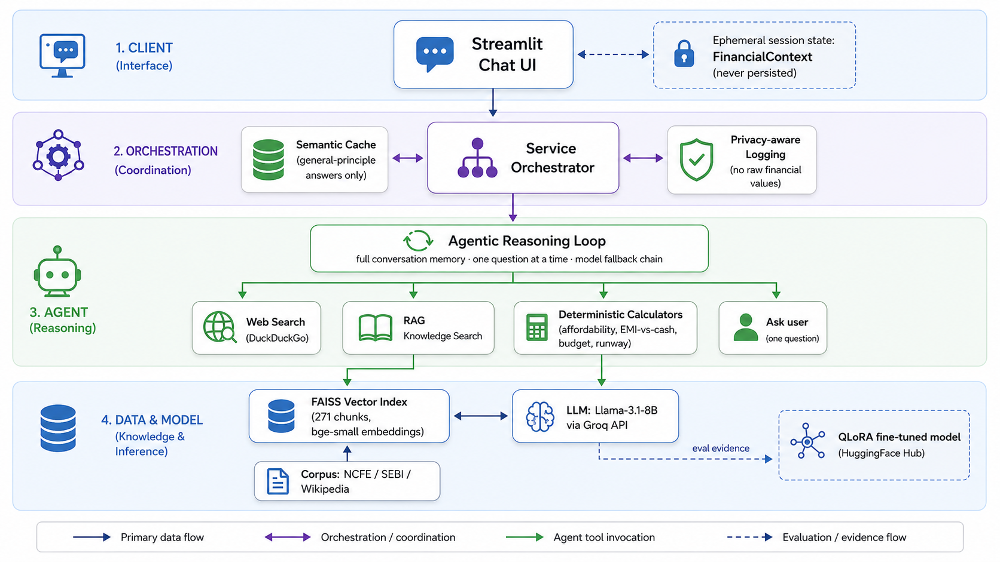

<div align="center">

# 🪙 NomosAI

**A goal-oriented agentic assistant for everyday financial decisions.**

RAG + tool-calling + a QLoRA-fine-tuned Llama-3.1-8B, built for students and early-career professionals in India.

[](https://domaingpt-hkf4czjwdsbyxxxsbniddi.streamlit.app/)
[](https://huggingface.co/prashantgautam8077/domaingpt-v1)
[](https://www.python.org/)
[](https://streamlit.io/)
[](#-license)

[Live Demo](https://domaingpt-hkf4czjwdsbyxxxsbniddi.streamlit.app/) · [Fine-tuned Model](https://huggingface.co/prashantgautam8077/domaingpt-v1) · [Architecture](#-architecture) · [Roadmap](#-roadmap)

</div>

> The repository, model, and dataset are named `domaingpt` (the project's original name). The product is **NomosAI** (Greek *nomos*, "law/principle" — fitting a principle-based money advisor).

---

## Overview

NomosAI answers the money questions people actually ask — *"can I afford this phone, cash or EMI?"*, *"how much should I earn to buy a Royal Enfield Bullet?"*, *"should I use a credit card?"* — and reasons like an expert instead of a form-filling chatbot.

It keeps the user's goal in view across the whole conversation, looks up facts it doesn't know (like a product's price) instead of asking, runs the actual arithmetic through **deterministic calculators** rather than trusting the model's mental math, grounds general advice in **cited investor-education sources**, and stays on the right side of the line between *arithmetic you can be directive about* and *investment-product advice that must stay educational* (SEBI RIA rules).

Personal financial data is **session-only** — never written to disk or a database.

## ✨ Key features

| Feature | What it does |
|---|---|
| 🎯 **Goal-oriented reasoning** | Reads the full conversation each turn: keeps the goal active, asks one question at a time, and stops asking once it can answer. No forgetting, no re-asking. |
| 🧮 **Deterministic tool calling** | Four calculators (affordability, EMI-vs-cash, budget split, job-quit runway) run in plain Python — the model decides *which* to call, never does the math itself. |
| 🔎 **Live web search** | Looks up real-world facts (e.g. a bike's price via DuckDuckGo) before asking the user. |
| 📚 **RAG with citations** | Grounds general-principle answers in NCFE / SEBI / Wikipedia sources, with links. |
| 🧠 **QLoRA fine-tune** | Llama-3.1-8B fine-tuned to emit correct tool calls, ask when info is missing, and hold the advice boundary. Zero-shot tool-selection **0.00 → 1.00** vs. base. |
| 🔐 **Privacy by design** | Income/expenses/debt/savings live only in session memory; logging never stores raw values. |
| 📊 **Eval + MLOps** | Custom eval harness, privacy-aware logging, restricted semantic cache, model fallback chain, ops dashboard. |

## 📈 Results

**Retrieval** (FAISS over the corpus): precision@5 **0.667**, MRR **0.833**.

**Zero-shot, base vs. QLoRA fine-tuned** (same prompt and eval set):

| Metric | Base Llama-3.1-8B | Fine-tuned |
|---|---|---|
| Calculator tool-selection | 0.00 | **1.00** |
| Context-elicitation ask-rate | 0.80 | **1.00** |
| Context-elicitation proceed-rate | 0.00 | **1.00** |

Base Llama, prompt-only, never emits a structured tool call (it answers calc questions in prose). After fine-tuning it emits correct calls while keeping its tone and advice-boundary behavior.

---

## 🏗 Architecture

<!-- Replace with a rendered diagram: docs/architecture.png (see the diagram prompt below) -->
<div align="center">
  
</div>

```
Streamlit UI (app/ui.py)  ──  FinancialContext in session_state (ephemeral)
        │  full conversation history
        ▼
service.answer()  ──  semantic cache (general-principle answers only)  ──  privacy-aware logging
        │
        ▼
agent (native tool-calling loop, no framework) + model fallback chain
   ├─ web_search .............. live facts like prices        (DuckDuckGo)
   ├─ search_financial_knowledge  RAG over the corpus         (FAISS + bge-small)
   ├─ calculators ............. deterministic Python          (personal args from context only)
   │       └─ missing a personal value? → ask ONE question, never guess
   └─ no tool ................. final grounded answer
        │
        ▼
Generation via Groq (Llama-3.1-8B, OpenAI-compatible API)
```

**How a turn flows:** the UI sends the whole conversation to `service.answer`, which checks the cache, then runs the agent across a fallback chain. The agent extracts any new personal facts into an ephemeral `FinancialContext`, then loops: the model picks a tool (web search, RAG, or a calculator) or asks one targeted question. Personal numbers are always taken from context, never from a model-guessed argument. The final answer is logged with **no** sensitive values.

<details>
<summary><strong>Why RAG *and* tools *and* fine-tuning?</strong></summary>

Each covers a failure the others can't: RAG supplies **external facts** with citations, calculators supply **correct arithmetic**, and the fine-tune supplies **behavioral judgment** (when to ask, which tool, how to phrase the tradeoff). Drop any one and a class of bug reappears — ungrounded claims, wrong math, or a form-filling bot that guesses and over-asks.
</details>

## 🛠 Tech stack

| Layer | Choice |
|---|---|
| Language | Python 3.13 |
| LLM serving | Groq (Llama-3.1-8B, OpenAI-compatible API) |
| Fine-tuning | QLoRA — `transformers`, `peft`, `trl`, `bitsandbytes` (Llama-3.1-8B-Instruct, 4-bit NF4) |
| Embeddings / vector search | `sentence-transformers` (BAAI/bge-small-en-v1.5) + FAISS (`IndexFlatL2`) |
| Web search | DuckDuckGo (`ddgs`) |
| UI | Streamlit |
| Hosting | Streamlit Community Cloud (app), HuggingFace Hub (model), HF Datasets (index) |
| Corpus | NCFE, SEBI, Wikipedia (82 docs → 271 chunks) |

## 📂 Folder structure

```
domaingpt/
├── app/
│   ├── ui.py                  # Streamlit chat app (the live demo)
│   └── dashboard.py           # MLOps ops dashboard
├── src/
│   ├── ingest.py              # corpus → chunks → embeddings → FAISS index
│   ├── retrieval.py           # load index, embed query, top-k search
│   ├── generate.py            # provider clients (Groq/OpenAI/vLLM) + rate-limit backoff
│   ├── tools.py               # 4 deterministic financial calculators
│   ├── agent.py               # native tool-calling loop + fallback chain
│   ├── context.py             # FinancialContext + slot-filling extraction
│   ├── websearch.py           # DuckDuckGo web search tool
│   ├── cache.py               # restricted semantic cache
│   ├── monitor.py             # privacy-aware request logging
│   ├── service.py             # orchestration: cache → agent → log
│   ├── eval.py                # eval harness: retrieval + tool-selection + elicitation
│   ├── eval_finetuned.py      # base-vs-fine-tuned eval (transformers)
│   ├── prepare_training_data.py  # QLoRA SFT dataset generation
│   ├── train_qlora.py         # QLoRA training (server/GPU)
│   └── upload_artifacts.py    # push FAISS index to a private HF Dataset
├── eval/eval_set.json         # labeled eval set (knowledge/calc/elicit/boundary)
├── data/train.jsonl           # QLoRA training examples
├── notebooks/                 # corpus exploration + fine-tune prep
├── tests/test_tools.py        # calculator unit tests
├── requirements.txt           # app deps (used by Streamlit Cloud)
├── requirements-train.txt     # training deps (GPU server)
└── .env.example
```

---

## 🚀 Getting started

### Prerequisites
- Python 3.13
- A [Groq API key](https://console.groq.com/) (free tier)
- A [HuggingFace token](https://huggingface.co/settings/tokens) (read access is enough to run the app)
- *(training only)* An NVIDIA GPU + access to `meta-llama/Llama-3.1-8B-Instruct`

### Installation

```bash
git clone https://github.com/PrashantGautam-alt/DomainGPT.git
cd DomainGPT
python3 -m venv .venv && source .venv/bin/activate
pip install -r requirements.txt
```

### Environment variables

Copy the example and fill in your keys:

```bash
cp .env.example .env
```

| Variable | Required | Purpose |
|---|---|---|
| `GROQ_API_KEY` | ✅ | LLM generation (Llama-3.1-8B via Groq) |
| `HF_TOKEN` | ✅ | Download the FAISS index from the private HF Dataset |
| `OPENAI_API_KEY` | optional | Only if you swap generation/judge to OpenAI |

### Local development

```bash
python src/ingest.py          # build the FAISS index from the corpus
streamlit run app/ui.py       # launch the chat app at localhost:8501
python src/eval.py            # run the eval harness
pytest tests/                 # run the calculator unit tests
```

## 💬 Usage examples

```
You:  How much should I earn a month to buy a Royal Enfield Bullet?
Nomos: (web-searches the price ≈ ₹1.65L) ... here's a monthly income to comfortably afford it.

You:  I earn 80000, spend 35000, no debt. Can I afford a 40000 phone?
Nomos: You have a ~₹45,000 monthly surplus, so yes — you can buy it outright this month.

You:  Which mutual fund should I buy?
Nomos: I can't recommend a specific fund, but here's how to think about picking one ...
```

## ☁️ Deployment

The app is deployed on **Streamlit Community Cloud** (the LLM is a Groq API call, so it runs on free CPU).

<details>
<summary><strong>Deploy your own instance</strong></summary>

1. Push the FAISS index to a private HF Dataset: `python src/upload_artifacts.py`
2. Go to [share.streamlit.io](https://share.streamlit.io), connect this repo, set **main file** to `app/ui.py`.
3. Under **Advanced settings → Secrets**, add:
   ```toml
   GROQ_API_KEY = "..."
   HF_TOKEN = "..."
   ```
4. Deploy. Pushes to `main` auto-redeploy.
</details>

The QLoRA model is trained separately on a GPU (`pip install -r requirements-train.txt` then `python src/train_qlora.py --epochs 4 --merge --push_to_hub --hub_model_id <you>/domaingpt-v1`).

## 🖼 Screenshots

| Chat + tool calling | Ops dashboard |
|---|---|
|  |  |

*(Add screenshots to `docs/` and update the paths.)*

## 🗺 Roadmap

- [ ] Serve the fine-tuned model behind the live app (GPU inference endpoint)
- [ ] Faithfulness + advice-boundary metrics (LLM-as-judge) in the eval table
- [ ] Multi-language support (Hindi + English)
- [ ] Security hardening pass (indirect prompt injection, excessive agency)
- [ ] v2: opt-in accounts + persistent goal tracking (with consent/retention design)

## 🤝 Contributing

Contributions are welcome.

1. Fork the repo and create a branch: `git checkout -b feature/your-feature`
2. Keep changes focused; add/update tests in `tests/` where relevant.
3. Run `pytest tests/` and make sure the app still launches.
4. Open a PR with a clear description of the change and why.

## ❓ FAQ

<details>
<summary>Does the app use the fine-tuned model?</summary>

The live app generates via Groq's base Llama-3.1-8B (CPU-friendly, free). The fine-tuned model and its eval results live on the HuggingFace Hub as evidence of the training work. Serving it behind the live app needs a GPU endpoint (see the roadmap).
</details>

<details>
<summary>Is this financial advice?</summary>

No. It's an educational tool. It can be directive about arithmetic (affordability, budgeting), but it will not recommend a specific stock or fund to buy — that's regulated territory (SEBI RIA), so it stays educational and points you to a registered advisor.
</details>

<details>
<summary>Where is my financial data stored?</summary>

Nowhere. Income/expenses/debt/savings live only in the browser session and disappear when you close it. Logs record tool usage and latency, never raw values.
</details>

<details>
<summary>Why FAISS instead of a hosted vector DB?</summary>

At 271 chunks, a hosted DB's extra machinery buys nothing. FAISS `IndexFlatL2` does exact search instantly and keeps the whole retrieval path transparent.
</details>

## 🙏 Acknowledgements

- [NCFE](https://ncfe.org.in/), SEBI investor education, and Wikipedia — grounding corpus
- [Meta Llama 3.1](https://huggingface.co/meta-llama/Llama-3.1-8B-Instruct), [Groq](https://groq.com/), [HuggingFace](https://huggingface.co/), [FAISS](https://github.com/facebookresearch/faiss), [Streamlit](https://streamlit.io/)

## 📄 License

Released under the **MIT License** — see [`LICENSE`](LICENSE).

```
MIT License

Copyright (c) 2026 Prashant Gautam

Permission is hereby granted, free of charge, to any person obtaining a copy
of this software and associated documentation files (the "Software"), to deal
in the Software without restriction, including without limitation the rights
to use, copy, modify, merge, publish, distribute, sublicense, and/or sell
copies of the Software, and to permit persons to whom the Software is
furnished to do so, subject to the following conditions:

The above copyright notice and this permission notice shall be included in all
copies or substantial portions of the Software.

THE SOFTWARE IS PROVIDED "AS IS", WITHOUT WARRANTY OF ANY KIND, EXPRESS OR
IMPLIED, INCLUDING BUT NOT LIMITED TO THE WARRANTIES OF MERCHANTABILITY,
FITNESS FOR A PARTICULAR PURPOSE AND NONINFRINGEMENT. IN NO EVENT SHALL THE
AUTHORS OR COPYRIGHT HOLDERS BE LIABLE FOR ANY CLAIM, DAMAGES OR OTHER
LIABILITY, WHETHER IN AN ACTION OF CONTRACT, TORT OR OTHERWISE, ARISING FROM,
OUT OF OR IN CONNECTION WITH THE SOFTWARE OR THE USE OR OTHER DEALINGS IN THE
SOFTWARE.
```

<div align="center">
Built by <a href="https://github.com/PrashantGautam-alt">Prashant Gautam</a> · <a href="https://domaingpt-hkf4czjwdsbyxxxsbniddi.streamlit.app/">Try NomosAI</a>
</div>
